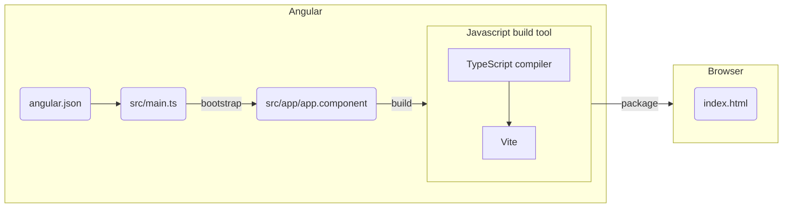

延續上一篇，我們完成以 Angular CLI 建立了聊天室專案 `chatroom` ，並認識一些環境參數與設定選項。

### 元件（component）

本篇首先認識集合**呈現**與**行為**的元件，它是由 CLI 所建立最頂層的元件，位於 `src/app/` ，基本上由 4 支檔案所組成：
* `app.component.html` 提供網頁元素
* `app.component.css` 提供樣式
* `app.component.ts` 提供參數與運作功能
* `app.component.spec.ts` 提供單元測試

對照到一個基本的網頁組成，就不難理解上述檔案的用途。
* HTML （附檔名 .html）
* CSS （附檔名 .css 、 .scss 、 …）
* JavaScript （附檔名 .js）

讓我們先介紹差異最大的部分： `app.component.ts`

```typescript
import { Component } from '@angular/core';

@Component({
  selector: 'app-root',
  templateUrl: './app.component.html',
  styleUrl: './app.component.css'
})
export class AppComponent {
  title = 'chatroom';
}
```

讓我們來解析這支程式：
* 第 1 行由 `@angular/core` 引入程式所需要的 `@Component` 裝飾子
* 第 3 行在類別（`class`）前加註 `@Component` 裝飾子，即告訴 Angular 這個類別被視為元件
* 第 4 ～ 6 行為 `@Component` 裝飾子的內容，稱為此元件的 `metadata` （元資料或中繼資料）
  * `selector` 參數最重要，它會告訴 Angular 要在網頁中尋找的名稱，每個名稱在專案內都是唯一的。例如，若網頁中包含 `<app-root></app-root>` 區塊， Angular 會找出元件類別並實體化它。
  * `templateUrl` 參數用來指示 HTML 檔的路徑。可換成 `template` 參數，直接接受 HTML 語法
  * `styleUrl` 參數用來指示樣式檔（ CSS 或 SCSS ）的路徑。可換成 `styles` 參數，直接接受樣式語法 
  * 在早期的版本，可能會看到 `standalone` 參數，代表此元件是否支援直接由別的元件引入，而不需要 Angular module 。
  > `standalone` 歷程：
  > * Angular 15 提出
  > * Angular 17 預設加入 `standalone: true` （在此之前，元件都必須宣告在 Angular module ）
  > * Angular 19 即使不加 `standalone: true` 選項，已預設為 `standalone`
* 第 8 ～ 10 行為元件類別的內部資料與函式。

在以下的 `app.component.html` 中加入以下語法後，在 `ng serve` 的運作下，就能在瀏覽器看到所呈現的畫面。

```html
<h1>Hello, {{ title }}</h1>
<p>恭喜！您的應用程式正常運行著！</p>
```

> 此處的 `{{ title }}` 是為**範本插值（ template interpolation ）**，為 `app.component.ts` 提供資料給 `app.component.html` 呈現的方式之一，亦即 `{{ title }}` 會被它本身的值（ `chatroom` ）替換掉。



<!-- more -->

即使已看到初步成果，但好奇的我們仍會想了解整個專案的運作流程。

首先，回想上一篇所提到的 Angular 設定檔 `angular.json` ，在 `projects.chatroom.architect.build.options` 中定義了專案的進入點與其樣式：

```json
"options": {
  // ...
  "index": "src/index.html",
  "browser": "src/main.ts",
  "styles": [
    "src/styles.css"
  ],
  // ...
},
```

我們回頭看 `main.ts` 呼叫 `bootstrapApplication` 函式，並指定 `AppComponent` 成為應用程式的根元件（root component）。

```typescript
import { bootstrapApplication } from '@angular/platform-browser';
import { appConfig } from './app/app.config';
import { AppComponent } from './app/app.component';

bootstrapApplication(AppComponent, appConfig)
  .catch((err) => console.error(err));
```

再來看最重要的 `index.html` ，即使 Angular CLI 建立的 `index.html` 內部並沒有任何 JavaScript 檔，但在 `body` 中包含了 `<app-root></app-root>` 區塊。因此在 `ng serve` 時， TypeScript 編譯器會產出 JavaScript 檔，並交由 Angular CLI 打包後加入至 `index.html` 檔。這些過程 Angular 都會自動處理完成，因此我們可以專注在程式功能的開發。

```html
<!doctype html>
<html lang="en">
<head>
  <meta charset="utf-8">
  <title>Chatroom</title>
  <base href="/">
  <meta name="viewport" content="width=device-width, initial-scale=1">
  <link rel="icon" type="image/x-icon" href="favicon.ico">
</head>
<body>
  <app-root></app-root>
</body>
</html>
```

總結上述步驟， Angular 運作流程可以下圖表示：



---

回到元件的運作，目前已知能使用範本插值將 `app.component.ts` 內的資料呈現在 `app.component.html` 。在 Angular 17 版後可以使用較新的寫法，由 `@angular/core` 引入 `signal()` 函式，在 Angular 設定**變更偵測（ change detection ）**為 `OnPush` 時，讓 Angular 將 signal 視為元件的相依變數，若其值有變化，會自動被標註（mark）進行渲染更新。

`app.component.html` 與 `app.component.ts` 分別可以改寫為

```html
<h1>Hello, {{ title() }}</h1>
<p>恭喜！您的應用程式正常運行著！</p>
```
```typescript
import { Component, signal } from '@angular/core';

@Component({
  selector: 'app-root',
  templateUrl: './app.component.html',
  styleUrl: './app.component.css'
})
export class AppComponent {
  title = signal('chatroom');
}
```

> `signal()` 歷程：
> * Angular 16 提出開發者預覽版
> * Angular 17 成為穩定版

參考官網：
* [Angular Signals](https://angular.dev/guide/signals)

---

隨著專案未來可能越來越龐大，不可能將所有的功能、樣式都集中在根元件 `AppComponent` ，因此我們需要設計更多元件以實現不同的商業邏輯（business logic），這個時候就能使用 Angular CLI 的 `ng generate component <component-name>` 或 `ng g c <component-name>` 來建立新的元件。

想定一個聊天室應該會有的使用情境：
1. 進入大廳（hall），顯示多個聊天室入口
2. 點選某個聊天室入口進入聊天室視窗（chatroom）
3. 在聊天室視窗中，有訊息串與輸入框，經由發送（Send）按鈕可將所輸入的訊息加入至訊息串
4. 在聊天室視窗中，有返回按鈕可回到大廳



對上述需求進行分析後，我們可以勾勒出基本架構與相關元件：



按以下步驟使用 Angular CLI 即可迅速建立所有檔案
1. 在 `src/app/` 建立 `pages` 資料夾，並在內部建立 `pages` 元件：
  `ng g c pages`
2. 接著在 `pages` 資料夾內部建立 `chatroom` 與 `hall` 兩個資料夾與其元件：
  `ng g c pages/chatroom`
  `ng g c pages/hall`
3. 接著在 `chatroom` 資料夾內部建立 `components` 資料夾，內部包含 `messages` 與 `message-input` 兩個資料夾與其元件：
  `ng g c pages/chatroom/components/messages`
  `ng g c pages/chatroom/components/message-input`

最終在 `src/app/` 成功建立所需元件。



下一章，我們會介紹如何將以上所建立的元件組合在一起。
