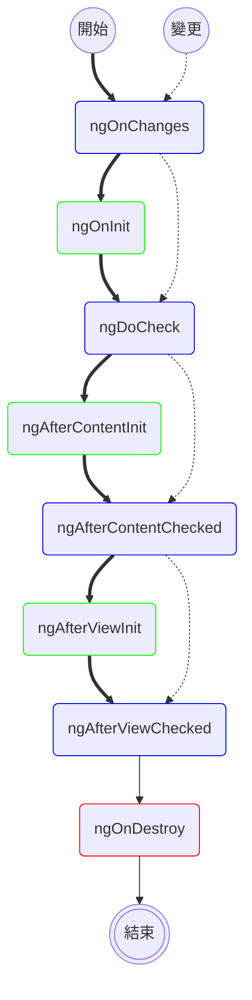

我們能看到 Angular 應用程式的運作畫面，都是由元件組成並呈現，而稍微複雜的系統，勢必會有元件或資訊上的顯示、隱藏、變更等操作。這些都與**生命週期（ life cycle ）**牽扯不了關係。要打造一個穩定可靠的應用程式，不得不從最基礎的元件來了解其生命週期。

Angular 的生命週期流程大致如下圖所示。每一個方框都代表 Angular 的運行狀態，會呼叫對應的內建函式，稱為**鉤子（ hook ）**。例如，某個元件首次被觸發顯示時，會依粗箭頭呼叫 `ngOnChanges` -> `ngOnInit` -> `ngDoCheck` -> ... 等鉤子。即使在程式中不見得會直接使用到，但 Angular 背後的生命週期仍按照這些鉤子運作。



由上圖我們可以歸納出幾個重點：
* 綠色方框為元件在首次觸發才會呼叫的鉤子
* 藍色方框為元件不管在首次觸發，或往後偵測到變更時，都會觸發的鉤子
* 紅色方框為元件結束時才會呼叫的鉤子

### 一般常用的鉤子

* `ngOnChanges`: 當一個或多個綁定的 `input` 值發生改變時，呼叫此鉤子。它會獲得一個 `SimpleChange` 型別的 map ，其包含各個 `input` 目前值（ `currentValue` ）與之前值（ `previousValue` ）。若沒有任何變更，此鉤子不會被呼叫。
* `ngOnInit`: 首次觸發，在 `ngOnChanges` 後（若有變更的話）僅呼叫一次，進行初始化行為。它被呼叫時的情況有以下兩種：
  * 沒有 `input` ，會呼叫此鉤子
  * 有 `input` ，在第一次的 `ngOnChanges` 後呼叫此鉤子
* `ngOnDestroy`: 當元件結束時才會呼叫的鉤子，對於清理行為（ cleanup ）很有幫助。

<!-- more -->

若要操作鉤子內的行為，建議在元件加入 `implements` 來實作它，這樣的方式確保能正確取得鉤子進行操作。例如，當在 `CarComponent` 實作 `OnInit` (1) ，若程式碼未加入 `ngOnInit()` 函式 (2) ，則編譯階段就會報錯。

```typescript
export class CarComponent implements OnInit { // ← (1)
  ngOnInit() { // ← (2)
    // Do something
  }
}
```

如果想要每次在 `input` 值變更時做一些行為，可以使用 `OnChanges` 鉤子。 `ngOnChanges` 函式的參數 `changes` 是一筆記錄，以 `input` 名稱為鍵（ key ），其值（ value ）為 `SimpleChange` 物件，包含
* `currentValue` 與 `previousValue` 分別存放目前值與之前值
* `isFirstChange()` 用來判斷此次變更是否為第一次的變更。

```typescript
export class CarComponent implements OnChanges {
  color = input.required<string>();

  ngOnChanges(changes: SimpleChanges): void {
    const carChange = changes['color'];
    console.log(`Color changed from ${carChange.previousValue} to ${carChange.currentValue}`);
    console.log(`Is it the first change? ${carChange.isFirstChange()}`);
    console.log(`My new color is ${this.color()}`); // 目前 input 值
  }
}
```

`ngOnDestroy` 鉤子設計用來銷毀元件。假設一個元件 `CarComponent` 建立時，每秒顯示字串 "Hello" ，當元件結束時就必須取消背景執行的工作，意即停止 `setInterval` 以避免記憶體洩漏（ memory leak ）問題。否則， JavaScript 會一直將此元件的實體（ instance ）保持在記憶體中，每秒顯示字串，直到永遠。

```typescript
export class CarComponent implements OnDestroy {
  color = input.required<string>();
  private interval: number;

  constructor() {
    this.interval = window.setInterval(() => {
      console.log('Hello');
    }, 1000);
  }

  ngOnDestroy(): void {
    window.clearInterval(this.interval);
  }
}
```

任何鉤子在 Angular 的生命週期都有其特別的用途，許多時候相同的行為（例如取值）會因為在不同的鉤子而得到不同的結果，這些問題通常都會出現在本章節未提到的鉤子中。
