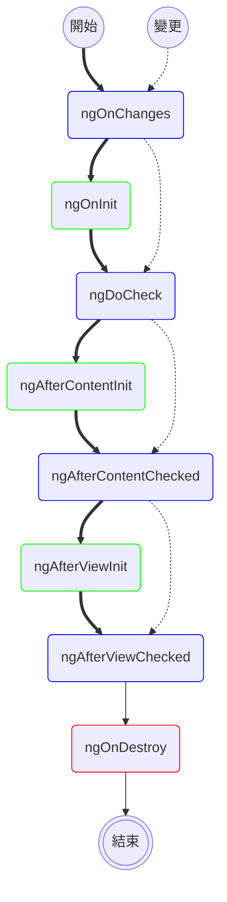

我們能看到 Angular 應用程式的運作畫面，都是由元件組成並呈現，而稍微複雜的系統，勢必會有元件或資訊上的顯示、隱藏、變更等操作。這些都與**生命週期（ life cycle ）**牽扯不了關係。要打造一個穩定可靠的應用程式，不得不從最基礎的元件來了解其生命週期。

Angular 的生命週期流程大致如下圖所示。每一個方框都代表 Angular 的運行狀態，會呼叫對應的內建函式，稱為**鉤子（ hook ）**。例如，某個元件首次被觸發顯示時，會依粗箭頭呼叫 `ngOnChanges` -> `ngOnInit` -> `ngDoCheck` -> ... 等鉤子。即使在程式中不見得會直接使用到，但 Angular 背後的生命週期仍按照這些鉤子運作。



由上圖我們可以歸納出幾個重點：
* 綠色方框為元件在首次觸發才會呼叫的鉤子
* 藍色方框為元件不管在首次觸發，或往後偵測到變更時，都會觸發的鉤子（其中只有 `ngOnChanges` 是針對 `input` 的變更才觸發）
* 紅色方框為元件結束時才會呼叫的鉤子

一般常用的鉤子有以下三種：

* `ngOnChanges`: 當一個或多個綁定的 `input` 值發生改變時，呼叫此鉤子。它會獲得一個 `SimpleChange` 型別的 map ，其包含各個 `input` 目前值（ `currentValue` ）與之前值（ `previousValue` ）。若沒有任何變更，此鉤子不會被呼叫。
* `ngOnInit`: 首次觸發，在 `ngOnChanges` 後（若有變更的話）僅呼叫一次，進行初始化行為。它被呼叫時的情況有以下兩種：
  * 沒有 `input` ，會呼叫此鉤子
  * 有 `input` ，在第一次的 `ngOnChanges` 後呼叫此鉤子
* `ngOnDestroy`: 當元件結束時才會呼叫的鉤子，對於清理行為（ cleanup ）很有幫助。

<!-- more -->

### `ngOnInit`

若要操作鉤子內的行為，建議在元件加入 `implements` 來實作它，這樣的方式確保能正確取得鉤子進行操作。例如，當在 `CarComponent` 實作 `OnInit` (1) ，若程式碼未加入 `ngOnInit()` 函式 (2) ，則編譯階段就會報錯。

```typescript
export class CarComponent implements OnInit { // ← (1)
  ngOnInit() { // ← (2)
    // Do something
  }
}
```

### `ngOnChanges`

如果想要每次在 `input` 值變更時做一些行為，可以使用 `OnChanges` 鉤子。 `ngOnChanges` 函式的參數 `changes` 是一筆記錄，以 `input` 名稱為鍵（ key ），其值（ value ）為 `SimpleChange` 物件，包含
* `currentValue` 與 `previousValue` 分別存放目前值與之前值
* `isFirstChange()` 用來判斷此次變更是否為第一次的變更。

```typescript
export class CarComponent implements OnChanges {
  color = input.required<string>();

  ngOnChanges(changes: SimpleChanges): void {
    const carChange = changes['color'];
    console.log(`Color changed from ${carChange.previousValue} to ${carChange.currentValue}`);
    console.log(`Is it the first change? ${carChange.isFirstChange()}`);
    console.log(`My new color is ${this.color()}`); // 目前 input 值
  }
}
```

### `ngOnDestroy`

`ngOnDestroy` 鉤子設計用來銷毀元件。假設一個元件 `CarComponent` 建立時，每秒顯示字串 "Hello" ，當元件結束時就必須取消背景執行的工作，意即停止 `setInterval` 以避免記憶體洩漏（ memory leak ）問題。否則， JavaScript 會一直將此元件的實體（ instance ）保持在記憶體中，每秒顯示字串，直到永遠。

```typescript
export class CarComponent implements OnDestroy {
  color = input.required<string>();
  private interval: number;

  constructor() {
    this.interval = window.setInterval(() => {
      console.log('Hello');
    }, 1000);
  }

  ngOnDestroy(): void {
    window.clearInterval(this.interval);
  }
}
```

任何鉤子在 Angular 的生命週期都有其特別的用途，許多時候相同的行為（例如取值）會因為在不同的鉤子而得到不同的結果，這些問題或解法通常都會出現以下鉤子中：

### `ngDoCheck`

雖然 `ngOnChanges` 與 `ngDoCheck` 是不管在首次觸發，或往後偵測到變更時，都會觸發的鉤子，差別在於偵測變更的部分。 `ngOnChanges` 只針對 `input` 值的變更，精確來說，是對 `input` 的**參考（ reference ）**變更。倘若 `input` 值是物件型別或陣列，內部參數值的變化並不會影響到 `input` 的參考，因此就不會觸發 `ngOnChanges` 鉤子。這種情況下，我們可以經由 `ngDoCheck` 鉤子取得任何變更。

> 因為 `ngDoCheck` 鉤子不管在任何情況下都會觸發，在如此頻繁的呼叫頻率下，要盡量簡化實作邏輯來避免效能降低。

### `ngAfterViewInit` 與 `ngAfterViewChecked`

有時候我們想要針對範本中元素（element）的各項資訊或進行操作，可以使用**範本參考變數**（ template reference variable ）取得該元素的參考。

以下是幾種應用的範例：

* 在範本中取得元素資訊
  ```html
  <input #phone placeholder="phone number" />
  <button type="button" (click)="callPhone(phone.value)">Call</button>
  ```
  只要以 `#` 搭配變數名稱即可賦予元素變數名稱。例如： `input` 的範本變數名稱為 `phone` ，接著就可以呼叫 `callPhone` 函式，並將 `phone.value` 傳入執行。

* 在範本中操作元素行為
  ```html
  <input #phone />
  <button (click)="phone.focus()">Focus</button>
  ```
  賦予元素 `phone` 變數名稱，並在按鈕加入觸發 `phone.focus()` 行為。

* 在程式碼中取得元素參考並操作元素行為
  ```typescript
  @Component({
    selector: 'app-login',
    template: `<input #loginInput [(ngModel)]="credentials.login" />`,
    imports: [FormsModule]
  })
  export class LoginComponent implements AfterViewInit {
    credentials = { login: '' };
    loginInput = viewChild.required<ElementRef<HTMLInputElement>>('loginInput');

    ngAfterViewInit(): void {
      this.loginInput().nativeElement.focus();
    }
  }
  ```
  解析上述程式碼：
  * 第 3 行我們替 `input` 宣告 `loginInput` 變數並在第 8 行取得此元素
  * 第 8 行的用意是告訴框架：我們需要從範本中查詢一個變數名稱為 `loginInput` 的元素，以該元素（型別為 `ElementRef<T>` ）進行訊號（signal）初始化。這個型別僅擁有一個欄位（field），即為型別為 `T` 的 `nativeElement` ，它就是對於此元素的參考。
  > 相較使用 `@ViewChild` 裝飾子， `viewChild` 與 `viewChild.required` 為基於訊號的方式，它永遠能與範本保持同步最新，若元素被銷毀，此訊號將會被設為 `undefined`
  * 第 10 ~ 12 行的 `ngAfterViewInit` 鉤子會在視圖（view）建立後馬上被呼叫，此時我們能保證該元素已存在並能操作。
  > 若嘗試在 constructor 取用元素，會報出錯誤訊息 [NG0951: Child query result is required but no value is available.](https://angular.dev/errors/NG0951)；若是在 `ngOnInit` 鉤子則無法操作元素行為。
  > 我們也可以在 `ngAfterViewChecked` 鉤子操作元素行為，它會在每次變更後的每一次視圖（view）檢查時被呼叫。

如果想要在各個不同的元件使用此功能，可以為它建立指令（directive），避免每個元件都存在重複的程式碼。 

### `ngAfterContentInit` 與 `ngAfterContentChecked`

Angular 框架提供許多提升元件擴充性的方法，其中一項就是讓元件具有動態內容（content）。例如：

```typescript
@Component({
  selector: 'app-card',
  template: `
  <div style="padding: 8px; outline: 1px solid black; border-radius: 8px;">
    <div>
      <h3>
        <ng-content select=".title"></ng-content>
      </h3>
      <p>
        <ng-content select=".content"></ng-content>
      </p>
    </div>
  </div>
  `
})
export class CardComponent { }
```

以上範本具有兩個 `ng-content` 元素，各自擁有不同的選擇器 `title` 與 `content` ，用來接收外部所賦予的內容。將不同的內容投射至 `CardComponent` 範本，即可呈現不同的結果。

範例一：
```html
<app-card>
  <div class="title">Happy Birthday</div>
  <p class="content">May your birthday mark the beginning of a wonderful period of time in your life!</p>
</app-card>
```



範例二：
```html
<app-card>
  <div class="title">
    <i>Merry Christmas</i>
  </div>
  <div class="content" style="display: flex; align-items: flex-start;">
    <p style="margin-top: 0px;">Lorem Ipsum has been the industry's standard dummy text ever since the 1500s, when an unknown printer took a galley of type and scrambled it to make a type specimen book.</p>
    
  </div>
</app-card>
```



可以看出 `title` 與 `content` 類別的元素，會各自填充在 `CardComponent` 範本的不同區塊，讓元件具備複用性、一致性與擴充性。

此時若我們仍想要取用這些投射進來的元素，類似視圖（view）使用 `viewChild` 是無法取得的，而是需要針對 `ng-content` 標籤使用 `contentChild` 或 `contentChildren` 。

我們以取得 `title` 的元素為例，步驟如下：

1. 在投射進去的元素內加上 `#title` 。
  ```html
  <div class="title" #title>...</div>
  ```

2. 取得元素後於 `ngAfterContentInit` 鉤子進行操作。
  ```typescript
  @Component({
    selector: 'app-card',
    template: `
    <-- 略 -->
    `
  })
  export class CardComponent implements AfterContentInit {
    title = contentChild.required<ElementRef>('title');

    ngAfterContentInit() {
      this.title().nativeElement.style.backgroundColor = 'pink';
    }
  }
  ```
  解析以上程式碼：
  * 第 8 行以 `contentChild` 取得變數名稱為 `title` 的元素
  * 第 11 行改變該元素的背景顏色



> 同樣地，使用 `ngAfterContentInit` 鉤子確保內容可以被取得，而 `ngAfterContentChecked` 鉤子會在每一次內容（content）檢查時被呼叫。

總結比較 `viewChild` 與 `contentChild` 的差異：
* `viewChild` 用來取得元件中直接包含的子元素。
* `contentChild` 用來取得存在於父元件的範本中，經由 `ng-content` 投射至元件中的元素。
